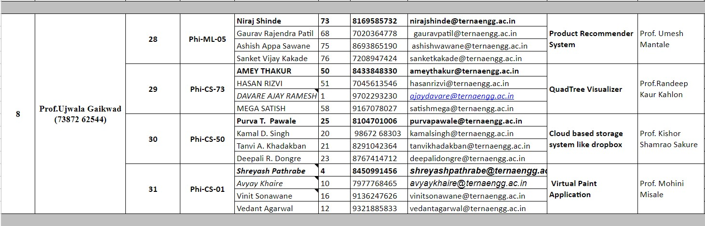
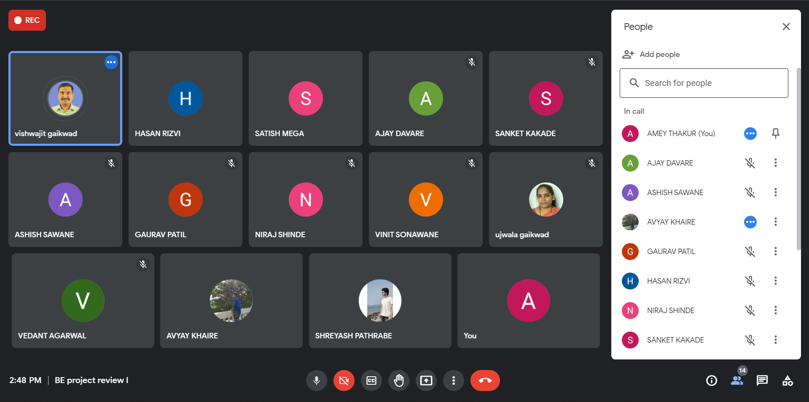
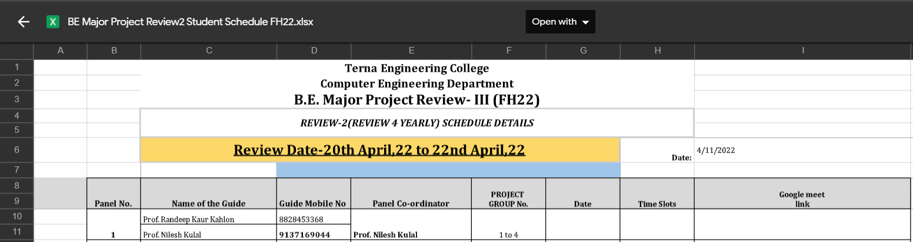
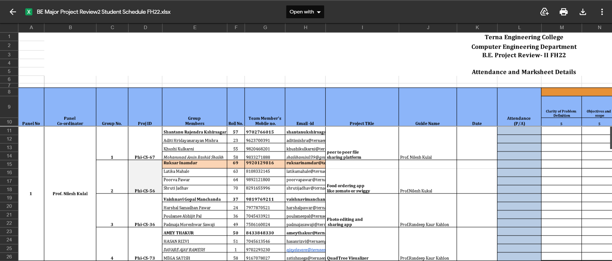

<div align="center">

  <a name="readme-top"></a>
  # QuadTree Visualizer

  [](LICENSE)
  
  [](https://github.com/Amey-Thakur/QUADTREE-VISUALIZER)
  [](https://ems.ijert.org/download-section_14TVPS67DSYEpSjrSUlGAmuer)
  [](https://github.com/Amey-Thakur/QUADTREE-VISUALIZER)

  A high-performance interactive simulation visualizing the efficiency of the QuadTree data structure in spatial partitioning and collision detection, built with Next.js and HTML5 Canvas.

  **[Source Code](Source%20Code/)** &nbsp;&middot;&nbsp; **[Research Paper](Research%20Paper/IJERTV11IS040156%20-%20QuadTree%20Visualizer.pdf)** &nbsp;&middot;&nbsp; **[Live Demo](https://amey-thakur.github.io/QUADTREE-VISUALIZER/)** &nbsp;&middot;&nbsp; **[Video Demo](https://youtu.be/8un0Qu8ibNk)**

  [](https://youtu.be/8un0Qu8ibNk)

</div>

---

<div align="center">
  [Authors](#authors) &middot; [Overview](#overview) &middot; [Features](#features) &middot; [Structure](#project-structure) &middot; [Results](#results-gallery) &middot; [Quick Start](#quick-start) &middot; [Academic Record](#academic-documentation) &middot; [Milestones](#educational-milestones) &middot; [References](#literature-survey) &middot; [Usage Guidelines](#usage-guidelines) &middot; [License](#license) &middot; [About This Repository](#about-this-repository) &middot; [Acknowledgments](#acknowledgments)
</div>

---

<!-- AUTHORS -->
<a name="authors"></a>
<div align="center">

  ## Authors

  **Terna Engineering College | Computer Engineering | Batch of 2022**

  <table>
  <td align="center">
  <a href="https://github.com/Amey-Thakur">
  <br />
  <b>Amey Thakur</b><br />
  (TU3F1819127)
  </a>
  </td>
  <td align="center">
  <a href="https://github.com/rizvihasan">
  <br />
  <b>Hasan Rizvi</b><br />
  (TU3F1819130)
  </a>
  </td>
  <td align="center">
  <a href="https://github.com/msatmod">
  <br />
  <b>Mega Satish</b><br />
  (TU3F1819139)
  </a>
  </td>

  </tr>
  </table>

  *Project Guide: **Prof. Randeep Kaur Kahlon** (Area of Specialization: [View PDF](Major-Project%20Selection/Project%20Guide%20Area%20of%20specialization%202021%20-%202022.pdf))*

</div>

---

<!-- OVERVIEW -->
<a name="overview"></a>
## Overview

**QuadTree Visualizer** is a comprehensive tool designed to demonstrate the efficacy of QuadTrees in optimizing spatial querying and collision detection. Unlike naive O(N²) collision checks, this system implements an efficient hierarchical data structure, visualizing `insert`, `retrieve`, and `clear` operations in real-time.

The application allows users to spawn varying numbers of particles, apply physics forces, and observe how the QuadTree dynamically partitions the 2D space to reduce computational complexity.

<div align="center">
  
  
</div>

> [!IMPORTANT]
> **Research Impact**
>
> This project was published as a research paper in the **International Journal of Engineering Research & Technology (IJERT)** (Volume 11, Issue 04) and is also available as a preprint on **viXra**. The project received an official **Publication Certificate** for its research contribution to engineering education.
>
> - [Preprint @viXra](https://vixra.org/abs/2204.0168)
> - [Published Paper @IJERT](https://ems.ijert.org/download-section_14TVPS67DSYEpSjrSUlGAmuer)
> - [Research Paper PDF](Research%20Paper/IJERTV11IS040156%20-%20QuadTree%20Visualizer.pdf)
> - [Publication Certificate](Research%20Paper/Certificates/IJERTV11IS040156%20Certificate%20-%20Amey%20Thakur.pdf)

### Engineering Thesis

| # | Name | Student ID | Description | Certificate | Access |
|---|---|---|---|---|---|
| 1 | **Amey Thakur** | TU3F1819127 | Official Engineering Thesis | [View Certificate](Research%20Paper/Certificates/IJERTV11IS040156%20Certificate%20-%20Amey%20Thakur.pdf) | [View PDF](BlackBook/BlackBook-Amey_Mahendra_Thakur-TU3F1819127.pdf) |
| 2 | **Hasan Rizvi** | TU3F1819130 | Official Engineering Thesis | [View Certificate](Research%20Paper/Certificates/IJERTV11IS040156%20Certificate%20-%20Hasan%20Rizvi.pdf) | [View PDF](BlackBook/BlackBook-Hasan_Mehdi_Rizvi-TU3F1819130.pdf) |
| 3 | **Mega Satish** | TU3F1819139 | Official Engineering Thesis | [View Certificate](Research%20Paper/Certificates/IJERTV11IS040156%20Certificate%20-%20Mega%20Satish.pdf) | [View PDF](BlackBook/BlackBook-Mega_Satish_Modha-TU3F1819139.pdf) |
| 4 | **Ajay Davare** | TU3F1718006 | Official Engineering Thesis | [View Certificate](Research%20Paper/Certificates/IJERTV11IS040156%20Certificate%20-%20Ajay%20Davare.pdf) | [View PDF](BlackBook/BlackBook-Ajay_Ramesh_Davare-TU3F1718006.pdf) |
| 5 | **Randeep Kaur Kahlon** | Guide | Project Guide & Mentor | [View Certificate](Research%20Paper/Certificates/IJERTV11IS040156%20Certificate%20-%20Randeep%20Kaur%20Kahlon.pdf) | - |
| 6 | **Group** | - | Combined Major Project Thesis | - | [View PDF](BlackBook/BlackBook-Amey-TU3F1819127_Hasan-TU3F1819130_Mega-TU3F1819139_Ajay-TU3F1718006.pdf) |

<br>

<p align="center">
  <strong>Defense Day Photos (April 25, 2022 - Monday) [10:53 AM]</strong>
  <br>
  <br>
  
  <br>
  <br>
  
</p>

<br>

### Additional Resources

| Resource | Description | Access |
|---|---|---|
| **Plagiarism Report** | Detailed analysis of content originality | [View PDF](Research%20Paper/QuadTree_Visualizer_Plagiarism_Report.pdf) |
| **Scan Report** | Automated similarity index scan result | [View PDF](Research%20Paper/QuadTree_Visualizer_Plagiarism_Scan_Report.pdf) |
| **Acceptance Letter** | Official acceptance from IJERT Editorial Board | [View PDF](Research%20Paper/IJERTV11IS040156_Acceptance.pdf) |
| **Payment Receipt** | Processing fee transaction confirmation | [View PDF](Research%20Paper/IJERTV11IS040156_payment-receipt.pdf) |

> [!TIP]
> **Performance Insight & Algorithm Visualization**
>
> This project empirically demonstrates the **O(N log N)** efficiency of QuadTree spatial partitioning compared to the traditional **O(N²)** brute-force approach for collision detection. The visualization serves as a practical, interactive tool for understanding how recursive subdivision optimizes computational load in dense particle systems.

---

<!-- FEATURES -->
<a name="features"></a>
## Features

| Feature | Description |
|---------|-------------|
| **Interactive Simulation** | Real-time particle system with adjustable spawn rates and physics. |
| **Dynamic Partitioning** | Visual representation of QuadTree nodes splitting and merging. |
| **Collision Detection** | Efficient O(N log N) collision checks visualized. |
| **Control Panel** | Tweak simulation parameters (capacity, boundary, speed) on the fly. |
| **Data Generation** | Modes for Random bodies, Spawned bodies, or mixed scenarios. |

### Tech Stack
- **Framework**: Next.js 14, React 18
- **Component Library**: Material UI (MUI v5)
- **Language**: TypeScript
- **Styling**: SCSS (Modules)
- **Graphics**: HTML5 Canvas API

---

<!-- STRUCTURE -->
<a name="project-structure"></a>
## Project Structure

```bash
QUADTREE-VISUALIZER/
│
├── .github/                                                      # GitHub Workflows & Metadata
│   └── workflows/
│       └── deploy.yml                                            # CI/CD Deployment Workflow
│
├── 25-04-2022/                                                   # Historical Project Snapshot
│   ├── 2022-04-25 at 10.53.18.jpeg                               # Defense Day Photo 1
│   ├── 2022-04-25 at 10.53.19.jpeg                               # Defense Day Photo 2
│   ├── 2022-04-25_at_10.53.19_Transparent.png                    # Defense Day Photo (Transparent)
│   ├── Final Presentation.pdf                                    # Final Defense Presentation (PDF)
│   ├── Final Presentation.pptx                                   # Final Defense Presentation (PPTX)
│   ├── Gmail - Photos.pdf                                        # Email Correspondence
│   ├── Presentation_Preparation.pdf                              # Prep Notes (PDF)
│   └── Presentation_Preparation.txt                              # Prep Notes (TXT)
│
├── BlackBook/                                                    # Official Engineering Thesis Documents
│   ├── BlackBook Cover Pages/                                    # Thesis Cover Designs
│   ├── Certificates/                                             # Signed Completion Certificates
│   ├── Draft/                                                    # Thesis Draft Versions
│   ├── BlackBook-Ajay_Ramesh_Davare-TU3F1718006.pdf              # Individual Thesis (Ajay Davare)
│   ├── BlackBook-Amey_Mahendra_Thakur-TU3F1819127.pdf            # Individual Thesis (Amey Thakur)
│   ├── BlackBook-Hasan_Mehdi_Rizvi-TU3F1819130.pdf               # Individual Thesis (Hasan Rizvi)
│   ├── BlackBook-Mega_Satish_Modha-TU3F1819139.pdf               # Individual Thesis (Mega Satish)
│   └── BlackBook-Group-Combined.pdf                              # Combined Major Project Thesis
│
├── docs/                                                         # Formal Documentation
│   └── SPECIFICATION.md                                          # Technical Architecture & Spec
│
├── Initial Work/                                                 # Early Prototypes & Research
│   ├── Initial PPTs/                                             # Idea Pitch Decks
│   ├── Phi Education/                                            # Educational Context
│   ├── Phi Tasks/                                                # Task Assignments
│   ├── QuadTree Implementation Examples/                         # Reference Implementations
│   ├── Phi Portal Dashboard.png                                  # UI Mockup - Dashboard
│   ├── Phi Portal Login.png                                      # UI Mockup - Login
│   └── Phi Potal Project Plan.png                                # Project Roadmap Visual
│
├── Major-Project Selection/                                      # Topic Selection & Approval Records
│   ├── BE STUDENTS LIST SH21/                                    # Student Batch List
│   ├── Approval Message.png                                      # Guide Approval Proof
│   ├── B.E. Major Project Team Building Details_FH2021.pdf       # Team Formation Doc
│   ├── BE Major Project Details of Div A_B_C_AY21_22_ Final.xlsx # Division Details
│   ├── BE STUDENTS LIST SH21.zip                                 # Student List Archive
│   ├── EPIC TN04_Master_BTechProjectList_TitlesForSelection.xlsx # Title Selection List
│   ├── Final Year Project.jpg                                    # Project Concept Art
│   ├── PHI-CS-73.jpeg                                            # Group ID Badge
│   ├── Project Guide Area of specialization 2021 - 2022.pdf      # Guide Domain List
│   ├── Project Guide Area of specialization 2021 - 2022.xlsx     # Guide Domain Data
│   ├── Studentcopy_TN04_BE_SH2021_SEM VII_PROJECT REVIEW.xlsx    # Review Details
│   └── TN04_Project Guide Selection.pdf                          # Allocation Letter
│
├── Major-Project-I/                                              # Semester VII Project Phase
│   ├── MAJOR_PROJECT-I_REPORT_PHI-CS-73.pdf                      # Phase I Report
│   ├── MAJOR_PROJECT_BE-COMPS_B-50,51,58.docx                    # Draft Report
│   ├── Major Project Attendance [25-10-2021].jpeg                # Attendance Record
│   ├── QuadTree_Visualizer_Major-Project-I_CS-73.pdf             # Phase I Presentation (PDF)
│   ├── QuadTree_Visualizer_Major-Project-I_CS-73.pptx            # Phase I Presentation (PPTX)
│   ├── Review_Major-Project-I_Attendance_Proof.png               # Review Attendance
│   ├── Studentcopy_TN04_BE_SH2021 _SEM VII_PROJECT REVIEW.xlsx   # Grading Sheet
│   └── TN04_CS Project Details of Div A_B_C Final 27th Aug.xlsx  # Division Allocations
│
├── Major-Project-II/                                             # Semester VIII Project Phase
│   ├── MAJOR_PROJECT-II_REPORT_PHI-CS-73.docx                    # Phase II Report (Docx)
│   ├── MAJOR_PROJECT-II_REPORT_PHI-CS-73.pdf                     # Phase II Report (PDF)
│   ├── Major-Project Report.pdf                                  # Final Report Draft
│   ├── QuadTree_Visualizer_Major-Project-II_CS-73.pdf            # Phase II Presentation (PDF)
│   └── QuadTree_Visualizer_Major-Project-II_CS-73.pptx           # Phase II Presentation (PPTX)
│
├── Mega/                                                         # Archival Attribution Assets
│   └── Mega.png                                                  # Author Profile Image (Mega Satish)
│
├── Reference Papers/                                             # Literature Survey & Bibliography
│   ├── A Quadtree-based Hierarchical Clustering Method.pdf       # Reference Paper
│   ├── An Effective Way to Represent Quadtrees.pdf               # Reference Paper
│   ├── Efficient Quadtree Coding of Images and Video.pdf         # Reference Paper
│   ├── Energetics of a bouncing drop.pdf                         # Physics Reference
│   ├── Kinetic Compressed Quadtrees in the Black-Box Model.pdf   # Algorithm Reference
│   ├── Nodejs - Using JavaScript to Build...pdf                  # Tech Stack Reference
│   ├── Optimal Quadtree Construction Algorithms.pdf              # Algorithm Reference
│   └── Quad-Tree Motion Modelling with Leaf Merging.pdf          # Algorithm Reference
│
├── Research Paper/                                               # Published Research Assets
│   ├── Certificates/                                             # Publication Certificates (IJERT)
│   ├── Draft/                                                    # Paper Drafts
│   ├── IJERT/                                                    # Journal Correspondence
│   ├── IJERTV11IS040156 - QuadTree Visualizer.pdf                # Published Paper
│   ├── IJERTV11IS040156_Acceptance.pdf                           # Acceptance Letter
│   ├── IJERTV11IS040156_payment-receipt.pdf                      # Payment Receipt
│   ├── QuadTree_Visualizer_Plagiarism_Report.pdf                 # Plagiarism Report
│   └── QuadTree_Visualizer_Plagiarism_Scan_Report.pdf            # Scan Report
│
├── Review-1/                                                     # First Progress Review
│   ├── QuadTree_Visualizer_Review-1_CS-73.pdf                    # Review 1 Report
│   ├── QuadTree_Visualizer_Review-1_CS-73.pptx                   # Review 1 Presentation
│   ├── Review-1_Attendance_Proof.png                             # Attendance Proof
│   └── Review-1_Panel.jpg                                        # Panel Photo
│
├── Review-2/                                                     # Second Progress Review
│   ├── QuadTree_Visualizer_Review-2_CS-73.pdf                    # Review 2 Report
│   └── QuadTree_Visualizer_Review-2_CS-73.pptx                   # Review 2 Presentation
│
├── Review-3/                                                     # Third Progress Review
│   ├── BE Major Project Review3 Student Schedule FH22.xlsx       # Schedule Data
│   ├── QuadTree_Visualizer_Review-3_CS-73.pdf                    # Review 3 Report
│   ├── QuadTree_Visualizer_Review-3_CS-73.pptx                   # Review 3 Presentation
│   ├── Review-3_Panel.png                                        # Panel Photo
│   └── Review-3_Schedule.png                                     # Schedule Image
│
├── Review-4/                                                     # Final Defense Review
│   ├── QuadTree_Visualizer_Review-4_CS-73.pdf                    # Final Review Report
│   └── QuadTree_Visualizer_Review-4_CS-73.pptx                   # Final Review Presentation
│
├── Source Code/                                                  # Application Source
│   └── quadtree-visualizer/                                      # Next.js Application Root
│       ├── components/                                           # React UI Components
│       ├── pages/                                                # App Routes
│       ├── public/                                               # Static Assets
│       ├── styles/                                               # SCSS Theme Files
│       ├── utils/                                                # Core QuadTree Logic & Physics Engine
│       └── package.json                                          # Dependencies
│
├── Source Code Output/                                           # Result Artifacts
│   └── Outputs.pdf                                               # Complete Output Gallery
│
├── Submission Report/                                            # Final Submission Docs
│   ├── Amey_B-50_Submission_Report.pdf                           # Submission Receipt (Amey)
│   ├── Hasan_B-51_Submission_Report.pdf                          # Submission Receipt (Hasan)
│   └── Mega_B-58_Submission_Report.pdf                           # Submission Receipt (Mega)
│
├── .gitattributes                                                # Git configuration
├── .gitignore                                                    # Git exclusion rules
├── BE-Major-Project.jpeg                                         # Project Banner Image
├── CITATION.cff                                                  # Scholarly Citation Metadata
├── codemeta.json                                                 # Machine-Readable Project Metadata
├── LICENSE                                                       # MIT License Terms
├── README.md                                                     # Comprehensive Archival Entrance
└── SECURITY.md                                                   # Vulnerability Exposure Policy
```

---

<!-- RESULTS -->
<a name="results-gallery"></a>
## Results Gallery

<div align="center">


</div>

---

## QuadTree Generation from Images

<div align="center">

An experimental implementation generating QuadTrees from static images.

[Kaggle Notebook](https://www.kaggle.com/code/ameythakur20/quadtree) &nbsp; | &nbsp; [Kaggle Dataset](https://www.kaggle.com/datasets/ameythakur20/images)


</div>

### Additional Resources

| # | Name | Type | Link |
| :-: | :--- | :--- | :-: |
| 1 | **QuadTree Notebook 1** | Jupyter Notebook | [View File](Initial%20Work/QuadTree%20Implementation%20Examples/QuadTree%20from%20Images/QuadTree_1.ipynb) |
| 2 | **QuadTree Notebook 2** | Jupyter Notebook | [View File](Initial%20Work/QuadTree%20Implementation%20Examples/QuadTree%20from%20Images/QuadTree_2.ipynb) |
| 3 | **Kaggle Notebook** | External Link | [View Notebook](https://www.kaggle.com/code/ameythakur20/quadtree) |
| 4 | **Kaggle Dataset** | External Link | [View Dataset](https://www.kaggle.com/datasets/ameythakur20/images) |
| 5 | **Croatia** | Image | [View Image](Initial%20Work/QuadTree%20Implementation%20Examples/QuadTree%20from%20Images/IMAGES/Croatia.jpg) |
| 6 | **Filly (Version 2)** | Image | [View Image](Initial%20Work/QuadTree%20Implementation%20Examples/QuadTree%20from%20Images/IMAGES/Filly-2.jpg) |
| 7 | **Filly (InstaDP)** | Image | [View Image](Initial%20Work/QuadTree%20Implementation%20Examples/QuadTree%20from%20Images/IMAGES/Filly-InstaDP.jpg) |
| 8 | **Filly** | Image | [View Image](Initial%20Work/QuadTree%20Implementation%20Examples/QuadTree%20from%20Images/IMAGES/Filly.jpg) |
| 9 | **Gateway of India** | Image | [View Image](Initial%20Work/QuadTree%20Implementation%20Examples/QuadTree%20from%20Images/IMAGES/Gateway%20of%20India.jpg) |
| 10 | **Injila** | Image | [View Image](Initial%20Work/QuadTree%20Implementation%20Examples/QuadTree%20from%20Images/IMAGES/Injila.jpg) |
| 11 | **Lake** | Image | [View Image](Initial%20Work/QuadTree%20Implementation%20Examples/QuadTree%20from%20Images/IMAGES/Lake.jpg) |
| 12 | **Park** | Image | [View Image](Initial%20Work/QuadTree%20Implementation%20Examples/QuadTree%20from%20Images/IMAGES/park.jpg) |

---

<!-- QUICK START -->
<a name="quick-start"></a>
## Quick Start

### 1. Prerequisites
Ensure your environment meets the minimum specifications:
- **Node.js**: Version **14** or higher.
- **npm**: Version **6** or higher.
- **Browser**: Modern web browser (Chrome/Edge recommended) for HTML5 Canvas.

> [!WARNING]
> **Technical Dependencies & Environment**
>
> This system relies on **HTML5 Canvas** for high-performance graphical rendering and **Node.js** for the development server. For stable execution and accurate visual output, ensure that dependencies are installed cleanly and the application is run in a standard modern browser environment.

### 2. Setup & Deployment
1.  **Clone the Repository**:
    ```bash
    git clone https://github.com/Amey-Thakur/QUADTREE-VISUALIZER.git
    cd QUADTREE-VISUALIZER
    ```
2.  **Install Dependencies**:
    Navigate to the source directory and install the required packages:
    ```bash
    cd "Source Code/quadtree-visualizer/"
    npm install
    ```

### 3. Launch Application
1.  **Start the Development Server**:
    ```bash
    npm run dev
    ```
2.  **Access Web Gateway**:
    -   Navigate to: `http://localhost:3000`

---

<!-- ACADEMIC DOCUMENTATION -->


<!-- ACADEMIC DOCUMENTATION -->
## Academic Documentation
This section archives the formal milestones of the Bachelor of Engineering (B.E.) degree.

### 1. Project Inception (Topic Selection)
- **Selection Process**: [Team Building Details](Major-Project%20Selection/B.E.%20Major%20Project%20Team%20Building%20Details_FH2021.pdf)
- **Guide Allocation**: [Project Guide Selection](Major-Project%20Selection/TN04_Project%20Guide%20Selection.pdf)
- **Reference**: [Project Guide Specialization](Major-Project%20Selection/Project%20Guide%20Area%20of%20specialization%202021%20-%202022.pdf)
- **Formal Approval**:
  <details>
    <summary><strong>View Approval Message</strong></summary>
    <br>
    
  </details>
  <details>
    <summary><strong>View Project (Pic Credit: Supreet)</strong></summary>
    <br>
    
  </details>

### 2. Semester VII (Major Project - I | CSP705)
#### Review 1
- **Time**: 2:48 PM | **Meeting**: BE project review I
- **Presentation**: [PPTX](Review-1/QuadTree_Visualizer_Review-1_CS-73.pptx) | [PDF](Review-1/QuadTree_Visualizer_Review-1_CS-73.pdf)
- **Evaluation Evidence**:
  <details>
    <summary><strong>View Review Panel</strong></summary>
    <br>
    
  </details>
  <details>
    <summary><strong>View Attendance Proof</strong></summary>
    <br>
    
  </details>

#### Review 2
- **Presentation**: [PPTX](Review-2/QuadTree_Visualizer_Review-2_CS-73.pptx) | [PDF](Review-2/QuadTree_Visualizer_Review-2_CS-73.pdf)
- **Evaluation Evidence**:
  <details>
    <summary><strong>View Evaluation Assets</strong></summary>
    <br>
    <h4>Review Panel</h4>
    
    <br><br>
    <h4>Attendance Proof</h4>
    
  </details>

#### Final Review (Major Project - I | CSP705)
- **Date**: October 25, 2021
- **Time**: 12:29 PM
- **Meet Code**: `vqt-diqt-edq`
- **Presentation**: [PPTX](Major-Project-I/QuadTree_Visualizer_Major-Project-I_CS-73.pptx) | [PDF](Major-Project-I/QuadTree_Visualizer_Major-Project-I_CS-73.pdf)
- **Report**: [DOCX](Major-Project-I/QuadTree_Visualizer_Major-Project-I_CS-73.docx) | [PDF](Major-Project-I/QuadTree_Visualizer_Major-Project-I_CS-73.pdf)
- **Evaluation Evidence**:
  <details>
    <summary><strong>View Evaluation Assets</strong></summary>
    <br>
    <h4>Attendance Proof</h4>
    
  </details>

### 3. Semester VIII (Major Project - II | CSP805)
#### Review 3
- **Presentation**: [PPTX](Review-3/QuadTree_Visualizer_Review-3_CS-73.pptx) | [PDF](Review-3/QuadTree_Visualizer_Review-3_CS-73.pdf)
- **Scheduling**:
  <details>
    <summary><strong>View Review Schedule</strong></summary>
    <br>
    
  </details>
  <details>
    <summary><strong>View Review Panel</strong></summary>
    <br>
    
  </details>

#### Review 4
- **Presentation**: [PPTX](Review-4/QuadTree_Visualizer_Review-4_CS-73.pptx) | [PDF](Review-4/QuadTree_Visualizer_Review-4_CS-73.pdf)
- **Scheduling**:
  <details>
    <summary><strong>View Schedule & Panel</strong></summary>
    <br>
    <h4>Review Schedule</h4>
    
    <br><br>
    <h4>Review Panel</h4>
    
  </details>

#### Major Project - II | CSP805 (Report)
- **Report**: [DOCX](Major-Project-II/QuadTree_Visualizer_Major-Project-II_CS-73.docx) | [PDF](Major-Project-II/QuadTree_Visualizer_Major-Project-II_CS-73.pdf)

### 4. Final Defense (25-04-2022)
- **Presentation**: [PPTX](25-04-2022/Final%20Presentation.pptx) | [PDF](25-04-2022/Final%20Presentation.pdf)
- **Preparation Notes**: [PDF](25-04-2022/Presentation_Preparation.pdf) | [TXT](25-04-2022/Presentation_Preparation.txt)
- **Defense Day Photos**:
  <br><br>
  <div align="center">
    
    &nbsp;&nbsp;
    
  </div>

### 5. Research Publication (IJERT)
**"QuadTree Visualizer" (Volume 11, Issue 04, April 2022)**
- **Published Paper**: [IJERTV11IS040156](Research%20Paper/IJERTV11IS040156%20-%20QuadTree%20Visualizer.pdf)
- **Publication Certificates**:
  - **Guide (Prof. Randeep Kaur Kahlon)**: [View](Research%20Paper/Certificates/IJERTV11IS040156%20Certificate%20-%20Randeep%20Kaur%20Kahlon.pdf)
  - **Amey Thakur**: [View](Research%20Paper/Certificates/IJERTV11IS040156%20Certificate%20-%20Amey%20Thakur.pdf)
  - **Mega Satish**: [View](Research%20Paper/Certificates/IJERTV11IS040156%20Certificate%20-%20Mega%20Satish.pdf)
  - **Hasan Rizvi**: [View](Research%20Paper/Certificates/IJERTV11IS040156%20Certificate%20-%20Hasan%20Rizvi.pdf)
  - **Ajay Davare**: [View](Research%20Paper/Certificates/IJERTV11IS040156%20Certificate%20-%20Ajay%20Davare.pdf)
- **Compliance Documents**:
  - [Plagiarism Report](Research%20Paper/QuadTree_Visualizer_Plagiarism_Report.pdf)
  - [Acceptance Letter](Research%20Paper/IJERTV11IS040156_Acceptance.pdf)
  - [Payment Receipt](Research%20Paper/IJERTV11IS040156_payment-receipt.pdf)

### 6. Submission Reports (Black Book)
- **Amey Thakur**: [Submission Report (PDF)](Submission%20Report/Amey_B-50_Submission_Report.pdf) | [Final Black Book (PDF)](BlackBook/BlackBook-Amey_Mahendra_Thakur-TU3F1819127.pdf)
- **Hasan Rizvi**: [Submission Report (PDF)](Submission%20Report/Hasan_B-51_Submission_Report.pdf) | [Final Black Book (PDF)](BlackBook/BlackBook-Hasan_Mehdi_Rizvi-TU3F1819130.pdf)
- **Mega Satish**: [Submission Report (PDF)](Submission%20Report/Mega_B-58_Submission_Report.pdf) | [Final Black Book (PDF)](BlackBook/BlackBook-Mega_Satish_Modha-TU3F1819139.pdf)
- **Ajay Davare**: [Final Black Book (PDF)](BlackBook/BlackBook-Ajay_Ramesh_Davare-TU3F1718006.pdf)
- **Team Compilation**: [Combined Black Book (PDF)](BlackBook/BlackBook-Amey-TU3F1819127_Hasan-TU3F1819130_Mega-TU3F1819139_Ajay-TU3F1718006.pdf)

---

<!-- EDUCATIONAL MILESTONES -->
<a name="educational-milestones"></a>
## Educational Milestones (Phi Education)
**Mentored by**: Phi Education | **Students**: [Amey Thakur](https://github.com/Amey-Thakur), [Mega Satish](https://github.com/msatmod), [Hasan Rizvi](https://github.com/rizvihasan)

Initial training and milestones completed under the Phi Education track "Introduction to C Programming".

### Task 1: [Understand Object Oriented Programming in C](Initial%20Work/Phi%20Tasks/Task%201)
- **Task Details**: [View Description](Initial%20Work/Phi%20Tasks/Task%201/Task%2001.png)
- **Acceptance**: [View Approved Submission](Initial%20Work/Phi%20Tasks/Task%201/PHI%20CS%2073%20-%20Task%201%20%5BSUBMISSION%20-%203%5D%20APPROVED.png)

### Task 2: [Understand Design Patterns in C](Initial%20Work/Phi%20Tasks/Task%202)
- **Task Details**: [View Description](Initial%20Work/Phi%20Tasks/Task%202/Task%2002.png)
- **Doubts**: [View Doubts](Initial%20Work/Phi%20Tasks/Task%202/Doubts.pdf)
- **Acceptance**: [View Approved Submission](Initial%20Work/Phi%20Tasks/Task%202/PHI%20CS%2073%20-%20Task%202%20%5BSUBMISSION%20-%2015%5D%20APPROVED.png)

### Task 3: [Learn how to use TinyXml](Initial%20Work/Phi%20Tasks/Task%203)
- **Task Details**: [View Description](Initial%20Work/Phi%20Tasks/Task%203/Task%2003.png)
- **Doubts**: [View Doubt](Initial%20Work/Phi%20Tasks/Task%203/Doubts.png)
- **Acceptance**: [View Approved Submission](Initial%20Work/Phi%20Tasks/Task%203/PHI-CS-73%20TASK-3%20%5BSUBMISSION-1%5D%20APPROVED.png)

### Task 4: [Define ADT for Quad Tree](Initial%20Work/Phi%20Tasks/Task%204)
- **Task Details**: [View Description](Initial%20Work/Phi%20Tasks/Tasks%20Descriptions/Task4.jpeg)
- **Doubts**: [View Doubt](Initial%20Work/Phi%20Tasks/Task%204/Doubts.png) | [Response](Initial%20Work/Phi%20Tasks/Task%204/Doubts-Response.png)

### Task 5: [Define file format](Initial%20Work/Phi%20Tasks/Tasks%20Descriptions/Task5.jpeg)
### Task 6: [pcf_ui library](Initial%20Work/Phi%20Tasks/Task%206)
### Task 7 - 10: [View Descriptions](Initial%20Work/Phi%20Tasks/Tasks%20Descriptions/)

### Presentation
- **Presentation**: [PPTX](Initial%20Work/Initial%20PPTs/QUADTREE%20VISUALIZER.pptx) | [PDF](Initial%20Work/Initial%20PPTs/QUADTREE%20VISUALIZER.pdf)

### Academic Milestones (Introduction to C Programming)
This section provides a formal archival record of the foundational training curriculum completed at **Phi Education**. These milestones document the chronological progression of technical proficiency in C-based systems programming and data structure implementation, serving as the pedagogical foundation for the advanced algorithms utilized in this project.

| Milestones | Academic Evaluation | Knowledge Module | <div align="center">Technical Focus & Key Artifacts</div> |
| :---: | :---: | :---: | :--- |
| **Milestones**<br>**01** | [Certificate](Initial%20Work/Phi%20Education/Milestone%201%20Completed.png) | [Milestone_1](Initial%20Work/Phi%20Education/Introduction%20To%20C%20Programming/Milestone_1) | Basic Geometry & Unit Conversions (`Area of Circle/Rectangle`, `Temp/Weight Conversion`) |
| **Milestones**<br>**02** | [Certificate](Initial%20Work/Phi%20Education/Milestone%202%20Completed.png) | [Milestone_2](Initial%20Work/Phi%20Education/Introduction%20To%20C%20Programming/Milestone_2) | Mathematical Logic & Finance ADTs (`Factorial`, `Prime Check`, `GCD/LCM`, `Compound Interest`) |
| **Milestones**<br>**03** | [Certificate](Initial%20Work/Phi%20Education/Milestone%203%20Completed.png) | [Milestone_3](Initial%20Work/Phi%20Education/Introduction%20To%20C%20Programming/Milestone_3) | Fundamental Array Operations (`arraysearch.C`, `arraysort.C`) |
| **Milestones**<br>**04** | [Certificate](Initial%20Work/Phi%20Education/Milestone%204%20Completed.png) | [Milestone_4](Initial%20Work/Phi%20Education/Introduction%20To%20C%20Programming/Milestone_4) | Advanced Array Manipulations (`ARRAYOP.C`) |
| **Milestones**<br>**05** | [Certificate](Initial%20Work/Phi%20Education/Milestone%205%20Completed.png) | [Milestone_5](Initial%20Work/Phi%20Education/Introduction%20To%20C%20Programming/Milestone_5) | String Library Implementation (`strcompare.C`, `strcopy.C`, `strlength.C`, `strfindsubstring.C`) |
| **Milestones**<br>**06** | [Certificate](Initial%20Work/Phi%20Education/Milestone%206%20Completed.png) | [Milestone_6](Initial%20Work/Phi%20Education/Introduction%20To%20C%20Programming/Milestone_6) | Consolidated String Utility Engine (`STR.C`) |
| **Milestones**<br>**07** | [Certificate](Initial%20Work/Phi%20Education/Milestone%207%20Completed.png) | [Milestone_7](Initial%20Work/Phi%20Education/Introduction%20To%20C%20Programming/Milestone_7) | Complex String Analysis Algorithms (`stringoperation.C`) |
| **Milestones**<br>**08** | [Certificate](Initial%20Work/Phi%20Education/Milestone%208%20Completed.png) | [Milestone_8](Initial%20Work/Phi%20Education/Introduction%20To%20C%20Programming/Milestone_8) | Polymorphic Sorting Concepts (`sortdatatype.C`) |
| **Milestones**<br>**09** | [Certificate](Initial%20Work/Phi%20Education/Milestone%209%20Completed.png) | [Milestone_9](Initial%20Work/Phi%20Education/Introduction%20To%20C%20Programming/Milestone_9) | Linked List Data Structures (`Reverse`, `Merge Sort`, `Recursive Reverse`, `Pop/Push Operations`) |
| **Milestones**<br>**10** | [Certificate](Initial%20Work/Phi%20Education/Milestone%2010%20Completed.png) | [Milestone_10](Initial%20Work/Phi%20Education/Introduction%20To%20C%20Programming/Milestone_10) | Dictionary ADT Implementation (`dictionary.C`) |
| **Milestones**<br>**11** | [Certificate](Initial%20Work/Phi%20Education/Milestone%2011%20Completed.png) | [Milestone_11](Initial%20Work/Phi%20Education/Introduction%20To%20C%20Programming/Milestone_11) | Sequential File Processing & Tokenization (`FILEREAD.C`) |
| **Milestones**<br>**12** | [Certificate](Initial%20Work/Phi%20Education/Milestone%2012%20Completed.png) | [Milestone_12](Initial%20Work/Phi%20Education/Introduction%20To%20C%20Programming/Milestone_12) | Persistent Data Storage Mechanisms (`arrayfile.C`, `dictonary.C`) |
| **Milestones**<br>**13** | [Certificate](Initial%20Work/Phi%20Education/Milestone%2013%20Completed.png) | [Milestone_13](Initial%20Work/Phi%20Education/Introduction%20To%20C%20Programming/Milestone_13) | Iterative Data Structure Reversal (`reverselinklist.C`) |
| **Milestones**<br>**14** | [Certificate](Initial%20Work/Phi%20Education/Milestone%2014%20Completed.png) | [Milestone_14](Initial%20Work/Phi%20Education/Introduction%20To%20C%20Programming/Milestone_14) | Complex List Merging & Optimization Assessment (`14.c`) |

### Technical Prototypes & Early Research Implementations

Before the final Next.js implementation, several iterative prototypes were developed to evaluate various spatial partitioning logic and collision detection algorithms. These artifacts represent the technical evolution of the project.

| <div align="center">Phase</div> | <div align="center">Research Artifact</div> | <div align="center">Technical Objective & Focus</div> |
| :---: | :--- | :--- |
| **P-01** | [QuadTree Collision Visualizer](Initial%20Work/QuadTree%20Implementation%20Examples/QuadTree%20Collision%20Visualizer) | Initial feasibility study comparing O(N²) vs O(N log N) spatial logic. |
| **P-02** | [QuadTree Library](Initial%20Work/QuadTree%20Implementation%20Examples/QuadTree%20Library) | Decoupling of the QuadTree engine into a reusable, modular C-based library. |
| **P-03** | [QuadTree Visualizer (Prototype)](Initial%20Work/QuadTree%20Implementation%20Examples/QuadTree%20Visualizer) | Early-stage integration of graphical visualization with the recursive partitioning engine. |

---

<!-- REFERENCES -->
<a name="literature-survey"></a>
## Literature Survey & Bibliography

The development of the **QuadTree Visualizer** was informed by a comprehensive review of established research in computational geometry, spatial data structures, and high-performance rendering. The following bibliography constitutes the primary theoretical foundation for this project:

1. **A Quadtree-based Hierarchical Clustering Method** | [View PDF](Reference%20Papers/A%20Quadtree-based%20Hierarchical%20Clustering%20Method%20for%20Visualizing%20Large%20Point%20Dataset.pdf)  
   *Focus: Optimization of large-scale spatial datasets.*
2. **An Effective Way to Represent Quadtrees** | [View PDF](Reference%20Papers/An%20Effective%20Way%20to%20Represent%20Quadtrees.pdf)  
   *Focus: Theoretical memory and structure efficiency.*
3. **Efficient Quadtree Coding of Images and Video** | [View PDF](Reference%20Papers/Efficient%20Quadtree-Coding%20of%20Images%20and%20Video.pdf)  
   *Focus: Application of QuadTrees in signal processing.*
4. **Energetics of a Bouncing Drop** | [View PDF](Reference%20Papers/Energetics%20of%20a%20bouncing%20drop-Coefficient%20of%20restitution%2C%20bubble%20entrapment%2C%20and%20escape.pdf)  
   *Focus: Physics modeling and collision energetics.*
5. **Kinetic Compressed Quadtrees in the Black-Box Model** | [View PDF](Reference%20Papers/Kinetic%20Compressed%20Quadtrees%20in%20the%20Black-Box%20Model%20with%20Applications%20to%20Collision%20Detection%20for%20Low-Density%20Scenes.pdf)  
   *Focus: Advanced collision detection for dynamic systems.*
6. **Nodejs - High-Performance Network Programs** | [View PDF](Reference%20Papers/Nodejs%20-%20Using%20JavaScript%20to%20Build%20High-Performance%20Network%20Programs.pdf)  
   *Focus: Environment performance and real-time execution.*
7. **Optimal Quadtree Construction Algorithms** | [View PDF](Reference%20Papers/Optimal%20Quadtree%20Construction%20Algorithms.pdf)  
   *Focus: Recursive algorithm optimization.*
8. **Quad-Tree Motion Modelling with Leaf Merging** | [View PDF](Reference%20Papers/Quad-Tree%20Motion%20Modelling%20with%20Leaf%20Merging.pdf)  
   *Focus: Dynamic node management and leaf consolidation.*

---

<!-- =========================================================================================
                                     USAGE SECTION
     ========================================================================================= -->
<a name="usage-guidelines"></a>
## Usage Guidelines

This repository is openly shared to support learning and knowledge exchange across the academic community.

**For Students**  
Use this major project as a reference for understanding spatial partitioning, QuadTree data structures, and the implementation of recursive subdivision algorithms. The research assets and production scripts are documented to support self-paced learning and exploration of computational geometry.

**For Educators**  
This project may serve as a practical example or supplementary teaching resource for Computer Engineering curriculum or Major Project modules (`CSP705` and `CSP805`). Attribution is appreciated when utilizing content.

**For Researchers**  
The published paper and preprint provide insights into spatial partitioning logic, high-performance recursive algorithms, and the reduction of computational complexity in dynamic spatial environments.

---

<!-- LICENSE -->
<a name="license"></a>
## License

This repository and all linked academic content are made available under the **MIT License**. See the [LICENSE](LICENSE) file for complete terms.

> [!NOTE]
> **Summary**: You are free to share and adapt this content for any purpose, even commercially, as long as you provide appropriate attribution to the original author.

Copyright © 2022 Amey Thakur, Hasan Rizvi, Mega Satish

---

<!-- ABOUT -->
<a name="about-this-repository"></a>
## About This Repository

**Created & Maintained by**: [Amey Thakur](https://github.com/Amey-Thakur), [Mega Satish](https://github.com/msatmod) & [Hasan Rizvi](https://github.com/rizvihasan)  
**Academic Journey**: Bachelor of Engineering in Computer Engineering (2018-2022)  
**Institution**: [Terna Engineering College](https://ternaengg.ac.in/), Navi Mumbai  
**University**: [University of Mumbai](https://mu.ac.in/)

This repository serves as a permanent technical record for **QuadTree Visualizer**, developed as the **8th Semester Major Project**. It highlights the practical application of hierarchical data structures in spatial algorithm optimization and the deployment of high-performance interactive simulations via modern web interfaces.

**Connect**: [GitHub](https://github.com/Amey-Thakur) · [LinkedIn](https://www.linkedin.com/in/amey-thakur)

### Acknowledgments
<a name="acknowledgments"></a>

Grateful acknowledgment to **[Mega Satish](https://github.com/msatmod)** and **[Hasan Rizvi](https://github.com/rizvihasan)** for their pivotal roles and collaborative excellence during the development of this project. Their intellectual contributions, technical insights, and dedicated commitment to software quality were fundamental in achieving the system's analytical and functional objectives. This technical record serves as a testament to their scholarly partnership and significant impact on the final implementation.

Special thanks to **Prof. Randeep Kaur Kahlon** for her mentorship and guidance as the project mentor throughout the research and development phases of this engineering thesis.

---

<div align="center">

  [↑ Back to Top](#readme-top)

  [Authors](#authors) &middot; [Overview](#overview) &middot; [Features](#features) &middot; [Structure](#project-structure) &middot; [Results](#results-gallery) &middot; [Quick Start](#quick-start) &middot; [Academic Record](#academic-documentation) &middot; [Milestones](#educational-milestones) &middot; [References](#literature-survey) &middot; [Usage Guidelines](#usage-guidelines) &middot; [License](#license) &middot; [About This Repository](#about-this-repository) &middot; [Acknowledgments](#acknowledgments)

  <br>

  🎬 **[QuadTree Visualizer](https://github.com/Amey-Thakur/QUADTREE-VISUALIZER)**

  ---

  ### Presented as part of the 8th Semester Major-Project @ Terna Engineering College

  ### 🎓 [Computer Engineering Repository](https://github.com/Amey-Thakur/COMPUTER-ENGINEERING)

  **Computer Engineering (B.E.) - University of Mumbai**

  *Semester-wise curriculum, laboratories, projects, and academic notes.*

</div>
