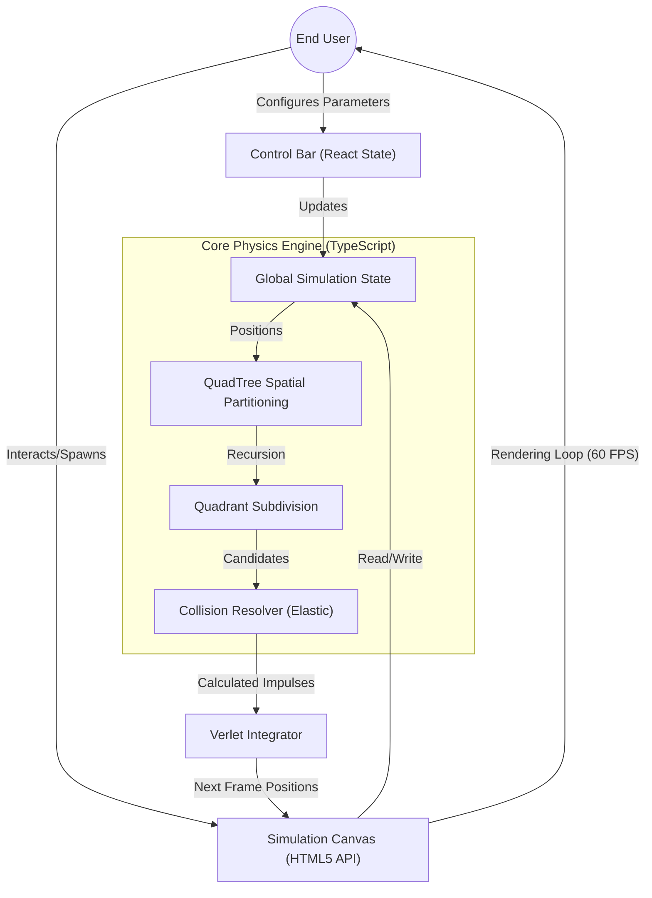

# Technical Specification: QUADTREE-VISUALIZER

## Architectural Overview

**QuadTree Visualizer** is a high-performance interactive simulation that visualizes the efficiency of the **QuadTree** data structure in spatial partitioning and collision detection. Unlike naïve $O(N^2)$ collision checks, this system implements a recursive hierarchical decomposition of 2D space, reducing computational complexity to approximately $O(N \log N)$ by only checking collisions between objects within the same quadrant.

### Processing Pipeline Diagram

---

## Technical Implementations

### 1. Spatial Engine: Recursive QuadTree Structure
The core of the system is the custom implementation of the QuadTree data structure.
-   **Recursive Decomposition**: The `QuadTree` class (`quadtree.ts`) dynamically subdivides the 2D canvas into four child nodes whenever a quadrant exceeds its capacity, creating a manageable tree depth.
-   **Optimized Querying**: Spatial queries retrieve only the relevant subset of bodies for collision checks, ignoring distant objects and drastically reducing CPU cycles.
-   **Dynamic Rebalancing**: The tree is rebuilt every frame to accommodate moving particles, demonstrating the structure's adaptability to dynamic data.

### 2. Physics & Simulation Layer
The physics engine handles the deterministic interactions between rigid bodies.
-   **Collision Dynamics**: `physics.ts` implements 2D elastic collision resolution using conservation of momentum and coefficient of restitution.
-   **Integration Support**: `circlebody.ts` manages the state of individual entities, including velocity vectors (`vector2d.ts`) and boundary constraints.
-   **Vector Arithmetic**: A custom linear algebra utility (`Vector2D`) provides essential mathematical operations (dot product, magnitude, normalization) for accurate physical simulation.

### 3. Application Layer: Next.js & React
The visualization wrapper provides the user interface and rendering lifecycle.
-   **Rendering Engine**: `simulation-canvas.tsx` leverages the HTML5 Canvas API within a `requestAnimationFrame` loop for high-performance, hardware-accelerated graphics.
-   **State Management**: `ControlBar.tsx` and `index.tsx` use React's `useState` and `useEffect` hooks to manage simulation parameters (gravity, particle count, time scale) and propagate changes instantly to the rendering loop.
-   **Design System**: Styled with **Material-UI (MUI)** and SCSS modules for a clean, academic, and responsive layout.

---

## Technical Prerequisites

-   **Runtime**: Node.js 18+ (LTS Recommended)
-   **Framework**: Next.js 14
-   **Library**: React 18
-   **Core Utilities**: `TypeScript` (Strict Typing), `SCSS` (Modular Styling).

---

*Technical Specification | Computer Engineering Project | Version 1.0*
